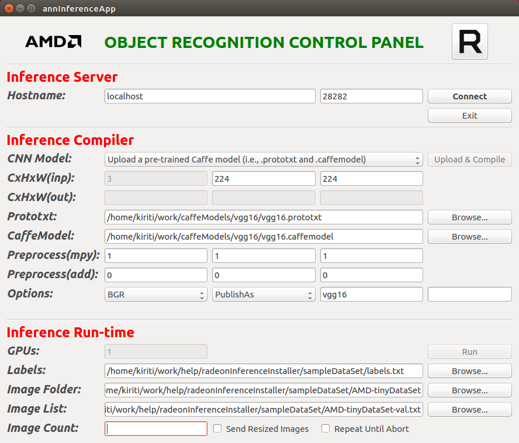

[](https://codeclimate.com/github/kiritigowda/help/maintainability)

# AMDOVX Neural Network Inference Engine - ANNIE Installer

This folder contains scripts to setup, build, and help run AMDOVX Neural Network Inference Engine. The open source GitHub project can be found at [amdovx-modules](https://github.com/GPUOpen-ProfessionalCompute-Libraries/amdovx-modules#amd-openvx-modules-amdovx-modules)

## Prerequisites for running the installer

1. ubuntu 16.04
2. [rocm supported hardware](https://rocm.github.io/hardware.html)
3. [rocm](https://github.com/RadeonOpenCompute/ROCm#installing-from-amd-rocm-repositories)
4. QTCreator, and QT5 or above
````
sudo apt-get install qt5-default qtcreator
````
5. install cmake and git
````
sudo apt-get install cmake git
````
## Installer
**RadeonInferenceInstaller.py** - Run this installer script to install all the dependencies and build the Inference Server.

**Usage** - To install the dependencies and the inference engine, cd into the scripts folder of this project and run the RadeonInferenceInstaller script as shown below.
````
python RadeonInferenceInstaller.py -s [sudo password - required] -d [dependencies directory - optional] -b [build directory - optional]
````

## Scripts 
This folder has the following python scripts in scripts folder

1. **inference-setup.py** - This script builds all the prerequisites required by inference modules. The setup script creates a deps folder and installs all the prerequisites, this script only needs to be executed once. If the -d option for directory is not given the script will install deps folder in '~/'or 'home' directory by default, else in the user specified folder.

usage:

````
python inference-setup.py -s [sudo password] -d [setup directory - optional]
```` 

2. **inference-build.py** - This script clones the latest inference modules from github, builds and installs the project. If the -d build directory is not given the script creates a AMDOVX folder in '~/' directory by default, else in the user specified folder.

usage:

````
python inference-build.py -s [sudo password] -d [build directory - optional]
```` 

3.**RadeonInferenceInstaller.py** - This installer script will run the inference setup and build scripts mentioned above.
````
python RadeonInferenceInstaller.py -s [sudo password - required] -d [dependencies directory - optional] -b [build directory - optional]
````
## Running the Inference Engine 

1. **Inference Server Application** - is built by the installer script. You can launch the server using the following commands 
````
export PATH=$PATH:/opt/rocm/bin
export LD_LIBRARY_PATH=$LD_LIBRARY_PATH:/opt/rocm/lib
annInferenceServer
````
2. **Inference Client Application** - The client Application is available in ~/AMDOVX/amdovx-modules/utils/annInferenceApp folder. Open annInferenceApp.pro with the QTCreator and build the client application and launch it.



3. After launching the server and client applications on the system, you can connect them using the default port. The server and client could also be launched on two different machines.

4. Once the connections are established, load the caffe model and prototxt to the server using the client application. The client application section Inference Complier needs to be completed as shown in the above example.

5. Now you can run a simple test inference using the tinyDataSet provided in this help project within the sampleDataSet folder. The client application section Inference Run-time needs the labels.txt, the AMD-tinyDataSet folder location, & AMD-tinyDataSet-val.txt provided in the sampleDataSet folder.

6. Once all the required fields are completed on the client app the run button will be green. You can now run the inference.
