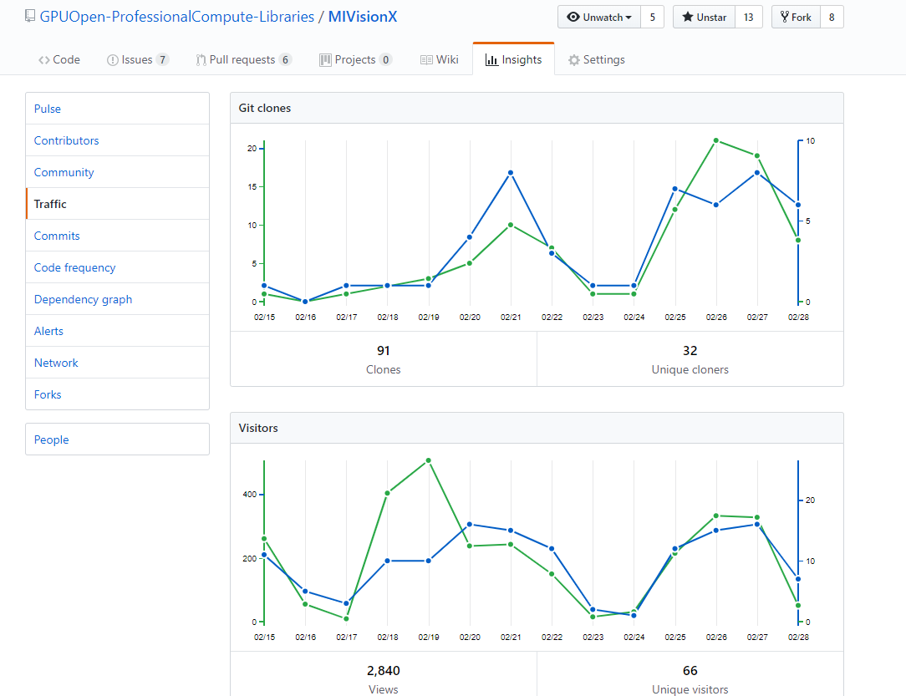
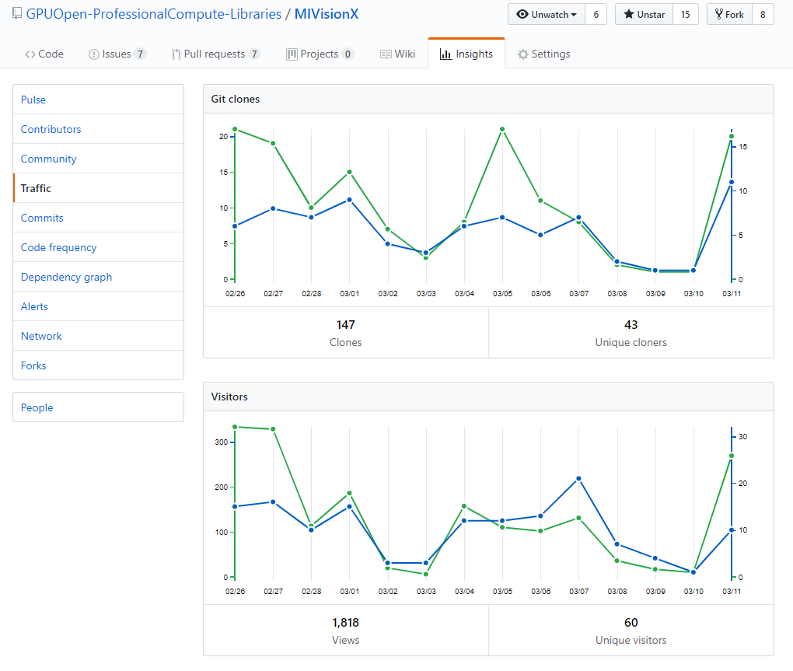
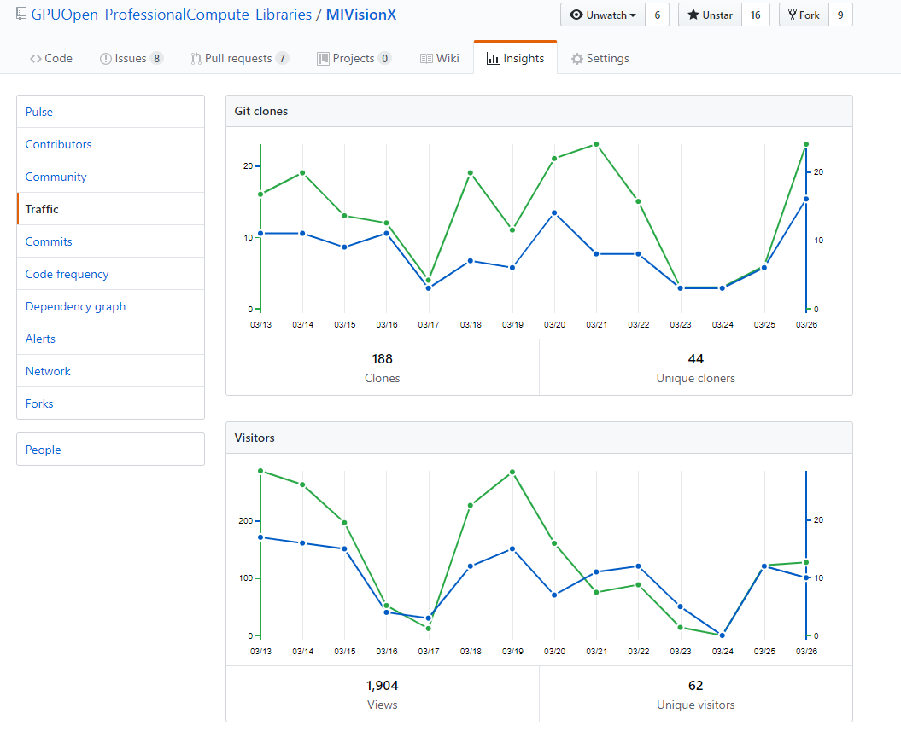
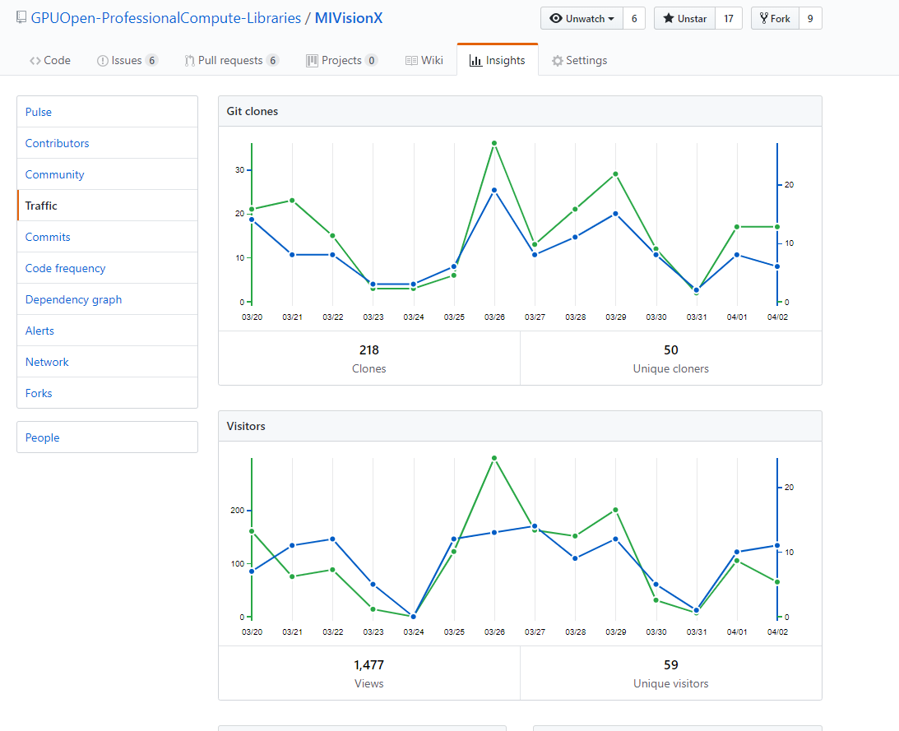
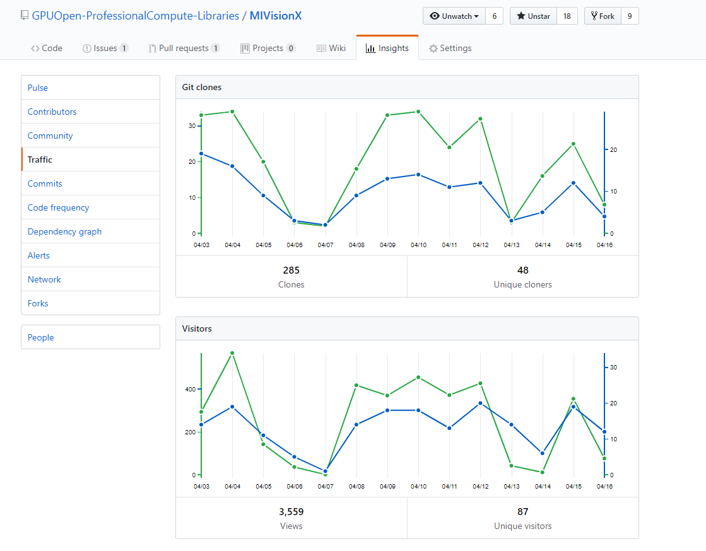
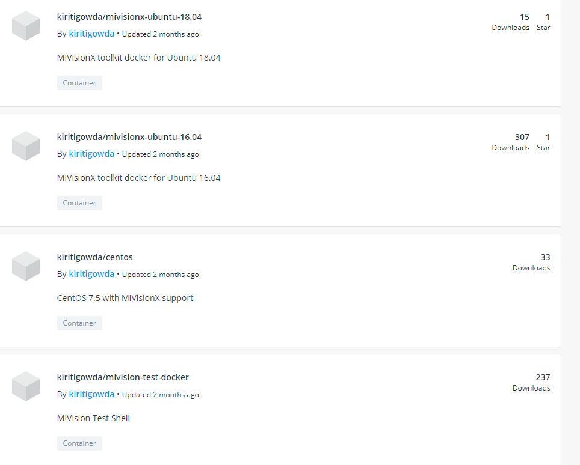
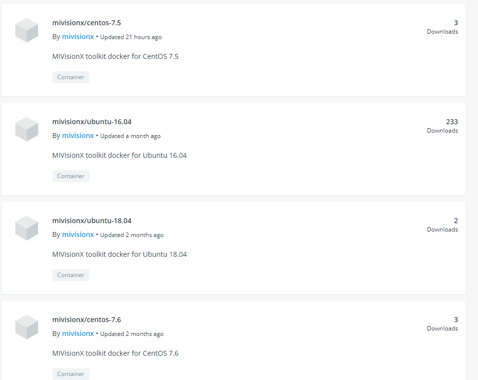

# MIVisionX Stats

MIVisionX was publically released on Dec 20th, 2018

## GitHub Stats

### Feb 15 & before Stats

MIVisionX roughly had around 5 - 15 unique clones a week

### Feb 

### March

### April

## Docker Stats

MIVisionX dockers were released on Dec 20th, 2018

### Hosted on private dockerhub till Feb 15th

### Hosted on MIVisionX dockerhub from Feb 16th - April 16th

